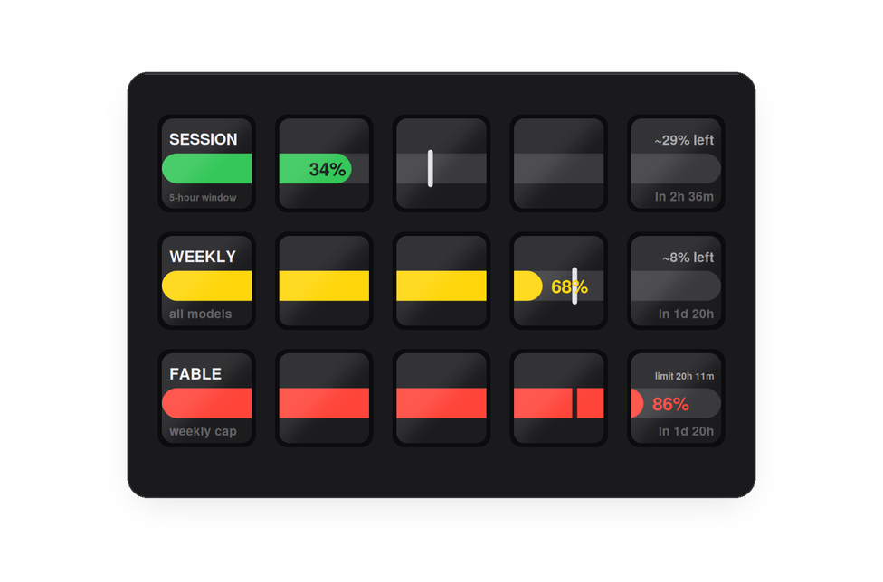

# Stream Deck for Claude

**Deck for Claude** (plugin ID `com.4xsdev.claude`, helper app ClaudeDeck) — a Stream Deck plugin for the **Claude desktop app** on macOS. Answer permission prompts (Allow once / for session / always, Deny), stop a response, send canned replies, fire Claude's keyboard shortcuts, watch status.claude.com — and see how much of your usage budget is left, on physical keys.

**[Website](https://kotyzap.github.io/Stream-Deck-Claude-Plugin/) · [Download plugin](dist/com.4xsdev.claude-kofi.streamDeckPlugin)**

Two builds of the same plugin (same UUID, either updates the other): the GitHub download above adds a **Buy me a Ko-fi** key; the Elgato Marketplace build (`dist/com.4xsdev.claude.streamDeckPlugin`) leaves it out, as Marketplace guidelines forbid sponsor links inside plugins.


## Usage on the deck



Leave the deck alone for 30 seconds and every key repaints as one chart: **session**, **weekly** and the **per-model cap**, one limit per deck row, the row's full width being 0–100%. Touch any key and your layout comes straight back — that first press is swallowed, so waking the deck can never fire Allow or Deny by accident. The **Claude Usage** key toggles the same view on demand.

Each bar carries a vertical **on-pace mark**: how far through that window you are. Bar behind the mark means you are under pace; past it means you are burning faster than the window allows, and the bar turns red. The right-hand caption is the forecast — `~8% left` at this rate, or `limit 20h 11m` if you are on course to run out before the reset.

Numbers come from the same place the desktop app's usage popup gets them: your existing Claude Code sign-in on this Mac, read locally. Nothing is sent anywhere. If you have never signed in to Claude Code the keys read `sign in`.

## Install

1. Download [`com.4xsdev.claude-kofi.streamDeckPlugin`](dist/com.4xsdev.claude-kofi.streamDeckPlugin) (or install from the Elgato Marketplace) and double-click it. Stream Deck installs the **Deck for Claude** action group, a ready-made profile for your device — **Claude** (MK.2, above), **Claude Mini** (3×2) or **Claude XL** (8×4) — and the helper app `~/Applications/ClaudeDeck.app`.
2. macOS asks once for **Accessibility** access for ClaudeDeck (System Settings → Privacy & Security → Accessibility). That is what lets it press buttons in Claude.
3. Switch to the Claude profile, or drag single actions onto your own keys.

Requirements: macOS 12+, Stream Deck software 6.9+, the Claude desktop app.

## Actions


| Action | What it does |
|---|---|
| **Allow once · Allow for session · Always allow · Deny** | Presses that button in the permission prompt currently on screen. The desktop app has no keyboard shortcuts for these; the helper finds the button through the macOS Accessibility API and presses it (~50 ms). Works even when Claude is not the front window. |
| **Stop** | Activates Claude and presses <kbd>Esc</kbd>. |
| **Reply** | Activates Claude, types the configured text (default `continue`) and presses Return. |
| **Shortcut** | Sends one of Claude.app's own accelerators: New chat <kbd>⌘N</kbd> · New Claude Code session <kbd>⌘⇧O</kbd> · Search <kbd>⌘⇧K</kbd> · Command palette <kbd>⌘K</kbd> · Sidebar <kbd>⌘B</kbd> · Previous / next session <kbd>⌘⇧[</kbd> <kbd>⌘⇧]</kbd> · Side chat <kbd>⌘;</kbd> |
| **Activate Claude** | Brings the Claude app to the front. |
| **Claude Status** | Polls `status.claude.com` every 60 s. Key colour follows the incident level; the small line names the affected component. Press opens the status page. |
| **Claude Usage** | Session / weekly / per-model limits with an on-pace mark and a forecast. Alone on a row it is a compact three-bar tile; press it to turn the whole deck into the chart and press again to go back. Several on one row share one wide bar across those keys. |
| **Inspect** | Writes every button label Claude exposes to `~/Library/Logs/ClaudeDeck.log` — the repair tool if Anthropic renames a button. Not on the 15-key profile by default (the Usage key has that spot); drag it on when you need it. |


## Profiles for Mini and XL

| Stream Deck Mini | Stream Deck XL |
|---|---|
|  |  |

All three come from `profile/build_profile.py` (`LAYOUTS`); the plugin manifest binds each to its device type, so Stream Deck installs only the matching one. The 15-key layout spends its last key on **Claude Usage**; XL has room for both that and **Inspect**; Mini keeps all six keys for controls and relies on the 30-second chart instead.

## How it works

```
Stream Deck key ──▶ plugin (Node.js, Elgato SDK v2)
                    open claudedeck://always-allow
                         │
                         ▼
                ~/Applications/ClaudeDeck.app     AppleScript applet registered for the claudedeck:// URL scheme
                         │
                         ▼
                Contents/MacOS/axpress            Swift: walks Claude's accessibility tree, presses the
                                                  button whose AX title or description matches
```

Typing (`Reply`) and shortcuts go through System Events after activating Claude.

Two actions talk to the network. `Claude Status` polls `status.claude.com`. `Claude Usage` reads the OAuth token Claude Code stores in your login keychain and calls Anthropic's usage endpoint with it — only while the chart is on screen, so there is no traffic at all while you are working the deck. Both stay on this Mac; the plugin has nowhere else to send anything.

## Repository layout

| Path | Contents |
|---|---|
| `plugin/` | Plugin source (`src/plugin.js`), rollup config, the built `com.4xsdev.claude.sdPlugin/` (manifest, `bin/plugin.js`, property inspectors, key art), `kofi/` (GitHub-only action), `package.sh`. |
| `applet/` | Helper app: `ClaudeDeck.applescript` (URL routing, typing, button label lists), `axpress.swift`, `build.sh`, `make-signing-cert.sh`. |
| `profile/` | `build_profile.py` generates the three `.streamDeckProfile` files (Stream Deck 7 v3 format) from `LAYOUTS`. |
| `docs/` | GitHub Pages site (`index.html`, images). Generated by `site/build_site.py`. |
| `dist/` | The one-click installers: `com.4xsdev.claude-kofi.streamDeckPlugin` (GitHub, with Ko-fi key) and `com.4xsdev.claude.streamDeckPlugin` (Marketplace). |

## Building

```bash
# helper app (macOS) — once: a self-signed identity so the Accessibility grant survives rebuilds
zsh applet/make-signing-cert.sh
zsh applet/build.sh                      # → ~/Applications/ClaudeDeck.app

# plugin bundle
cd plugin && npm install && npm run build && cd ..

# profile (needs Python 3)
python3 profile/build_profile.py

# installer: plugin + profile + helper app
zsh plugin/package.sh                    # → dist/com.4xsdev.claude.streamDeckPlugin (Marketplace)
zsh plugin/package.sh --kofi             # → dist/com.4xsdev.claude-kofi.streamDeckPlugin (GitHub)
```

Why the certificate: macOS ties the Accessibility grant to the app's code signature. An ad-hoc signature changes on every build and the grant is silently lost; a self-signed certificate gives a stable identity.

## Maintenance

- **A button got renamed.** Press **Inspect** while the prompt is visible, read the log, add the label to the lists at the top of `applet/ClaudeDeck.applescript` (`labelsAllowOnce`, `labelsAllowSession`, `labelsAlwaysAllow`, `labelsDeny`), rebuild the helper and the installer.
- **Logs.** Helper: `~/Library/Logs/ClaudeDeck.log`. Plugin: `~/Library/Application Support/com.elgato.StreamDeck/Plugins/com.4xsdev.claude.sdPlugin/logs/`.

## Limits

- macOS only (Accessibility API, AppleScript).
- The usage endpoint is not a documented API. It can change without notice, and it rate-limits: the plugin honours `Retry-After` and backs off rather than hammering it. Windows lengths (5 hours, 7 days) are assumed, not reported.
- Reply text is decoded as ASCII `%XX`; non-ASCII characters come out wrong.
- On a Mac other than the build machine the bundled helper counts as unsigned by Apple; it works after the Accessibility grant, but rebuilding there needs `make-signing-cert.sh` first.

## License

MIT — Pavel Kotyza · [4xs.dev](https://www.4xs.dev). Free and open source; if it saves you clicks, [buy me a Ko-fi](https://ko-fi.com/K3K6RR4LY). Not affiliated with Anthropic or Elgato.
